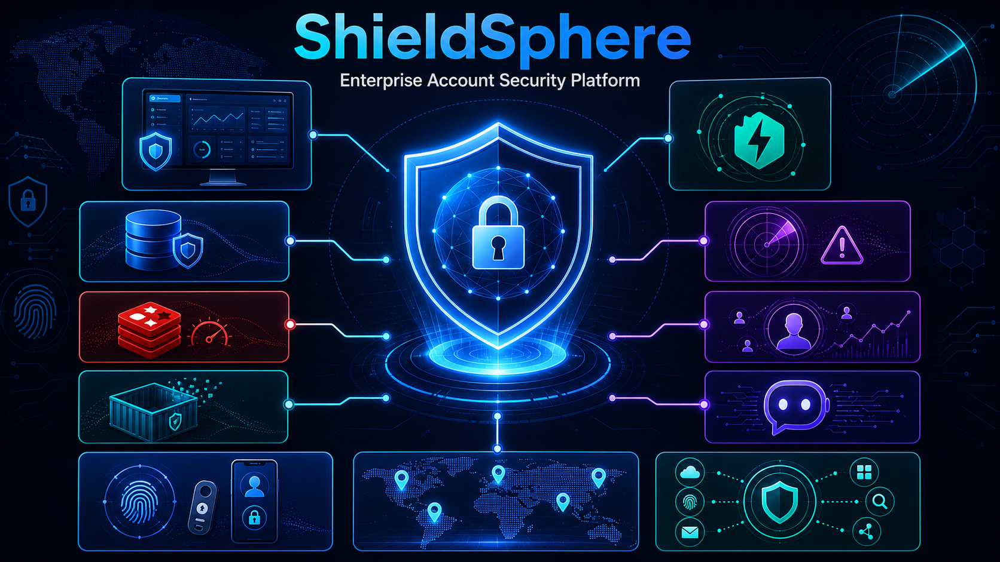
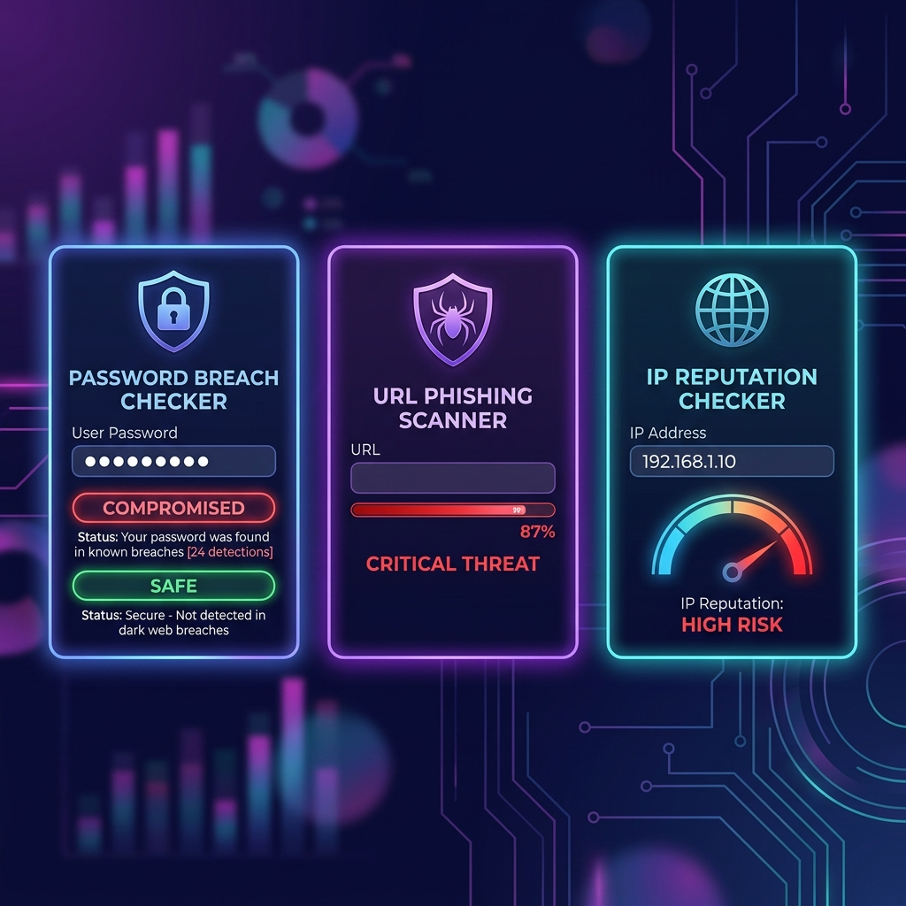
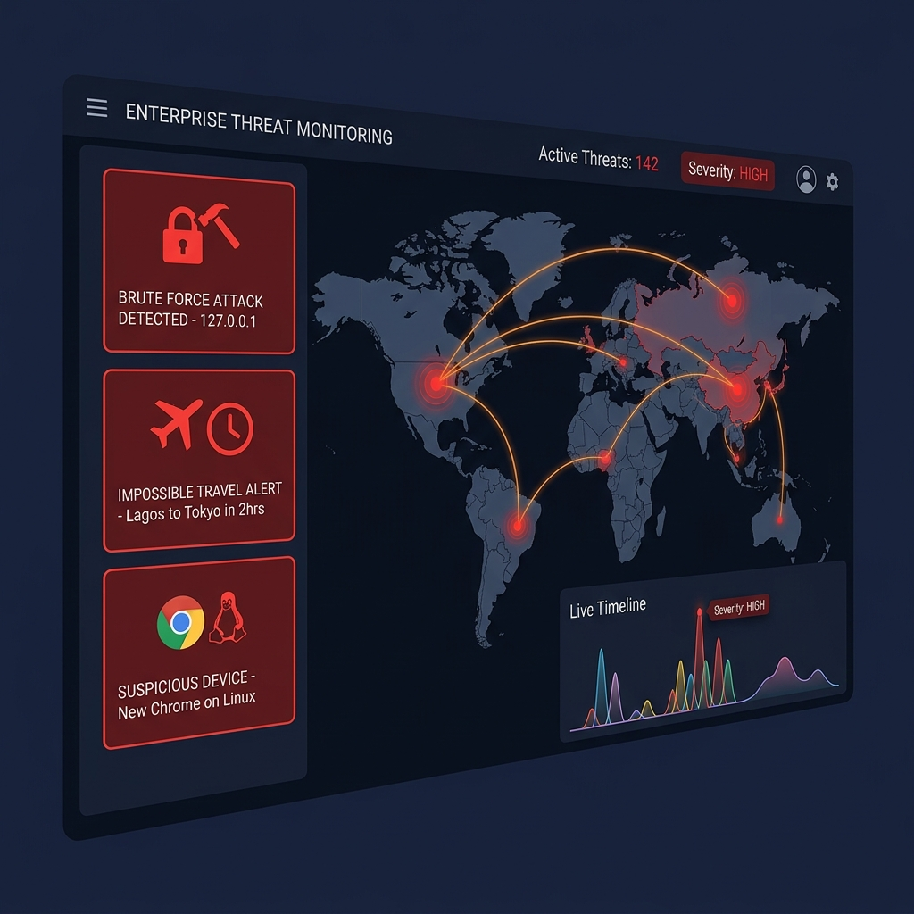
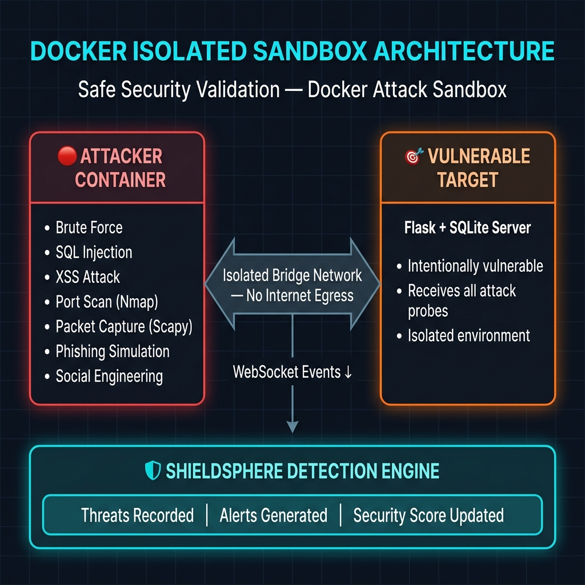
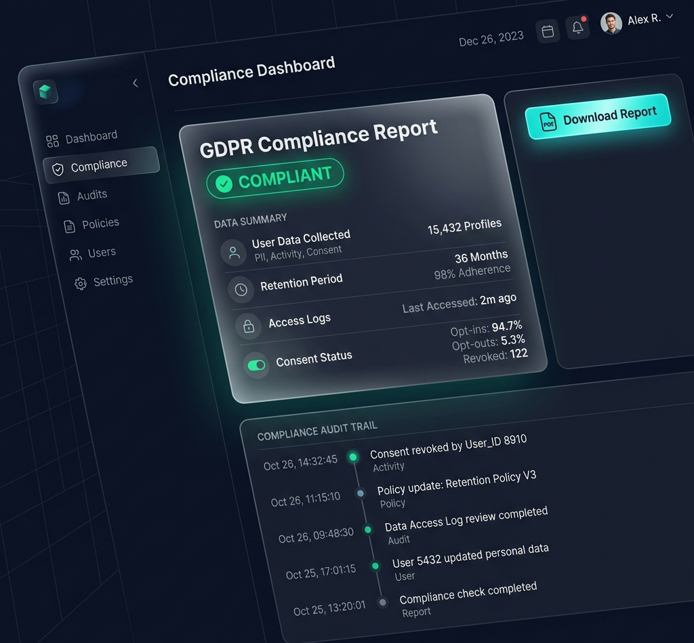
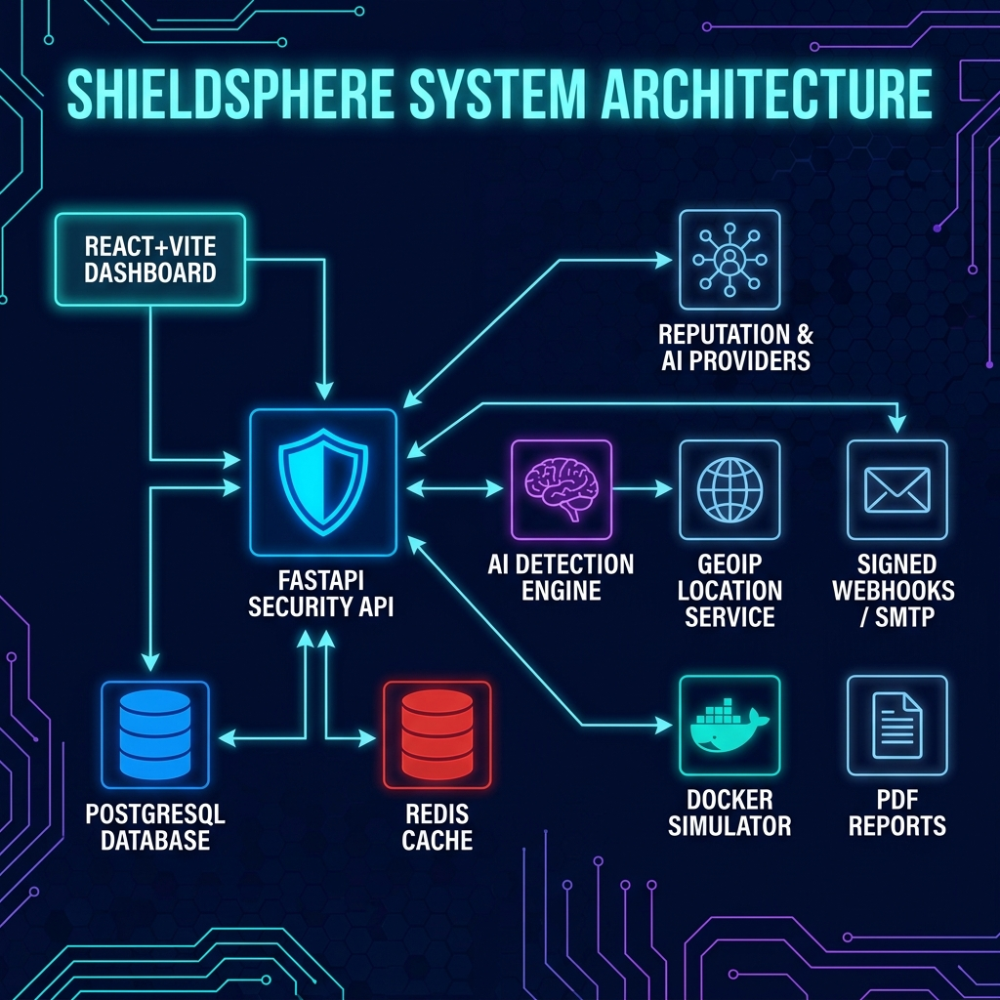
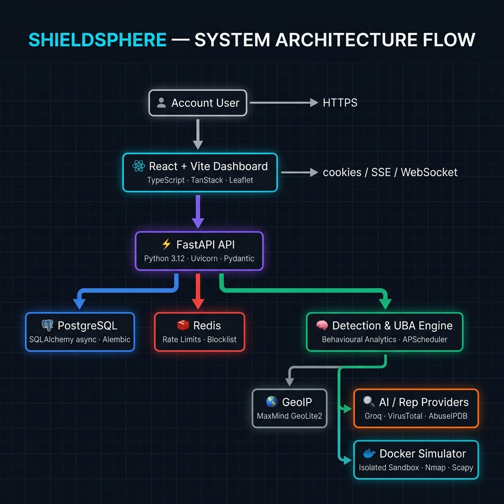
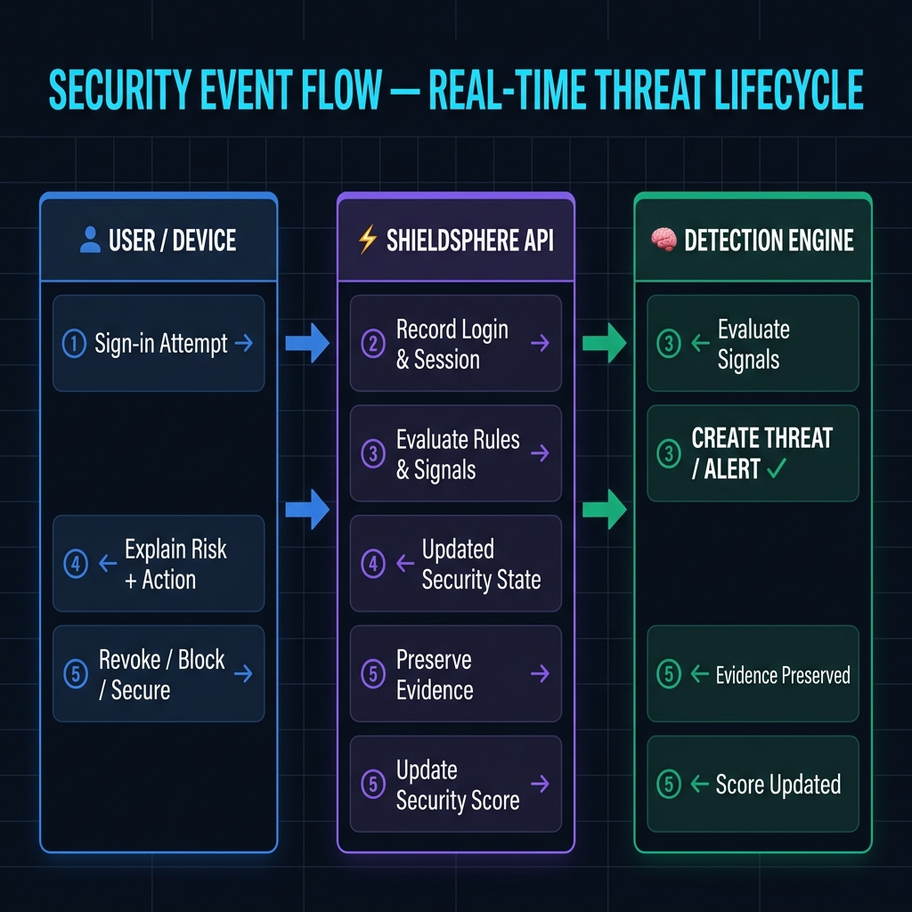
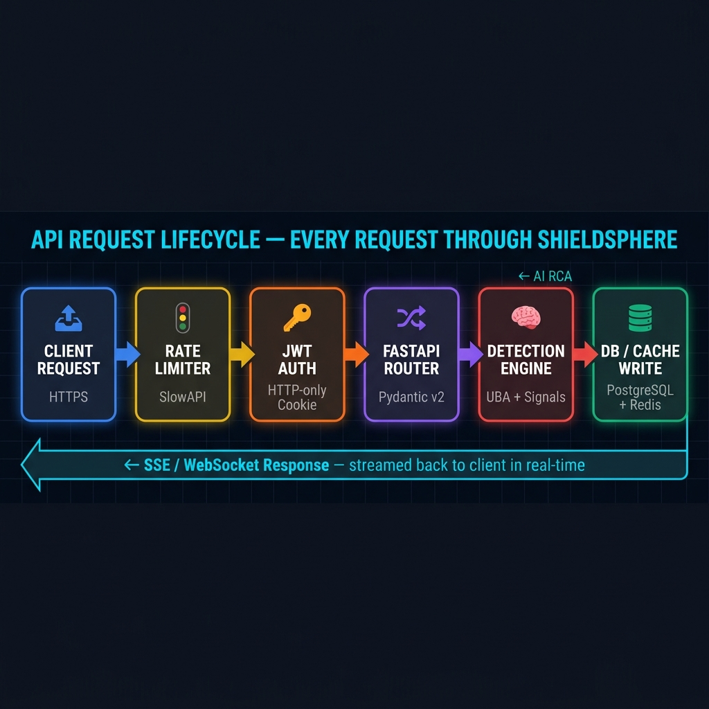

<div align="center">

<!-- ╔══════════════════════════════════════════════════════════════╗ -->
<!--        SHIELDSPHERE — ENTERPRISE ACCOUNT SECURITY PLATFORM       -->
<!-- ╚══════════════════════════════════════════════════════════════╝ -->



<!-- ── ANIMATED TYPEWRITER TAGLINE ── -->
<p align="center">

</p>

<!-- ── FEATURE PILL TABS ── -->
<p align="center">
  
  &nbsp;
  
  &nbsp;
  
  &nbsp;
  
</p>

<!-- ── TECH STACK BADGES ── -->
<p align="center">
  
  
  
  
  
  
  
  
  
  
</p>

<!-- ── STATUS BADGES ── -->
<p align="center">
  
  
  
  
  
</p>

<!-- ── LIVE DEPLOYMENT BUTTONS ── -->
<p align="center">
  <a href="https://shield-sphere-enterprise-account-se.vercel.app/" target="_blank">
    
  </a>
  &nbsp;&nbsp;
  <a href="https://shieldsphere-enterprise-account-security.onrender.com" target="_blank">
    
  </a>
  &nbsp;&nbsp;
  <a href="https://shieldsphere-enterprise-account-security.onrender.com/docs" target="_blank">
    
  </a>
</p>

</div>

---

<!-- ━━━━━━━━━━━━━━━━━━━━━━━━━━━━━━━━━━━━━━━━━━━━━━━━━━━━━━━━━━━━━━━━━━━━━━━━ -->

## 📋 Table of Contents

<details open>
<summary><strong>Click to expand / collapse</strong></summary>

| # | Section |
|---|---------|
| 1 | [🔴 The Problem](#-the-problem) |
| 2 | [✅ Solution Overview](#-solution-overview) |
| 3 | [⭐ Why ShieldSphere is Different](#-why-shieldsphere-is-different) |
| 4 | [🚀 Live Deployments](#-live-deployments) |
| 5 | [🛠 Platform Features](#-platform-features) |
| 6 | [🏗 System Architecture](#-system-architecture) |
| 7 | [🔄 Security Workflow & API Lifecycle](#-security-workflow--api-lifecycle) |
| 8 | [💻 Technology Stack](#-technology-stack) |
| 9 | [📁 Project Structure](#-project-structure) |
| 10 | [⚡ Quick Start](#-quick-start) |
| 11 | [⚙️ Environment Configuration](#️-environment-configuration) |
| 12 | [🧪 Testing & Quality Checks](#-testing--quality-checks) |
| 13 | [☁️ Deployment](#️-deployment) |
| 14 | [🔒 Security Notes](#-security-notes) |
| 15 | [📜 License](#-license) |

</details>

---

<!-- ━━━━━━━━━━━━━━━━━━━━━━━━━━━━━━━━━━━━━━━━━━━━━━━━━━━━━━━━━━━━━━━━━━━━━━━━ -->

## 🔴 The Problem

Modern account security is **fragmented by design**. Authentication, device management, login history, breach detection, suspicious-activity alerts, compliance evidence — they all live in separate silos. This leaves critical questions unanswered in real time:

<div align="center">

| ❓ Question | 😰 The Reality Without ShieldSphere |
|-------------|--------------------------------------|
| **Who is signed in right now?** | No unified session visibility |
| **Is this login pattern unusual?** | No behavioral baseline to compare |
| **Was the threat blocked and recorded?** | No end-to-end audit trail |
| **What should the user do next?** | No guided containment path |
| **Can defenses be tested safely?** | No isolated simulation environment |

</div>

> **ShieldSphere brings all of these answers into one enterprise account-security control center.**

---

## ✅ Solution Overview

ShieldSphere is a full-stack platform that protects an account from sign-in through incident response — connecting **prevention**, **detection**, **response**, and **safe validation** in one product.

<div align="center">

| 🔰 Security Stage | 🛡 ShieldSphere Capability | ✅ User Outcome |
|:-----------------:|:--------------------------|:---------------|
| 🧱 **Prevent** | Password intelligence, passkeys, 2FA, trusted devices, IP blocklist | Reduces account-takeover risk before it starts |
| 👀 **Observe** | Login history, active sessions, recognized-device locations, audit trail | Makes account activity understandable and traceable |
| 🧠 **Detect** | Brute-force, SQLi, XSS, phishing, port scan, vulnerability & behavioural signals | Converts suspicious activity into threats and alerts |
| 🚨 **Respond** | Guided "Secure My Account" containment, session revocation, device distrust, IP blocking | Provides immediate, focused recovery actions |
| 🧪 **Validate** | Docker-isolated sandbox simulations and attack-to-defense replay | Demonstrates that defensive controls work safely |
| 📋 **Prove** | Executive PDF reports and GDPR Excel export | Produces understandable evidence for compliance workflows |

</div>

---

## ⭐ Why ShieldSphere is Different

> **It does not only report security status — it connects prevention, detection, response, and safe validation in one user-facing product.**

<div align="center">

| 🔑 Unique Feature | 💡 What Makes It Valuable |
|:------------------|:--------------------------|
| 🧪 **Attack-to-Defense Replay** | Runs controlled scenarios in an isolated Docker sandbox, then shows the full progression from attack activity → detection → alerting → blocking → outcome |
| 🧭 **Contextual AI Copilot** | Answers questions using the user's real security context: threats, alerts, login activity, devices, score factors, settings, and navigation guidance |
| 🗺️ **Location-Aware Account Visibility** | Displays approximate session and recognized-device locations with details on hover, without exposing unnecessary location data |
| 🧬 **Two-Device Behavioural Baseline** | Learns normal patterns only after two successful sign-ins from two recognized devices, reducing false confidence from a single-device baseline |
| 🛟 **Guided Account Containment** | Consolidates urgent actions—revoke sessions, distrust devices, block suspicious IPs, and protect sign-in—into one response path |
| 📄 **Human-Readable Compliance Output** | Creates structured PDF security reports and Excel GDPR exports instead of raw JSON dumps |

</div>

---

## 🚀 Live Deployments

<div align="center">

<table>
  <thead>
    <tr>
      <th>🏷️ Service</th>
      <th>🔗 URL</th>
      <th>📊 Status</th>
    </tr>
  </thead>
  <tbody>
    <tr>
      <td align="center">🌐 <strong>Frontend</strong></td>
      <td><a href="https://shield-sphere-enterprise-account-se.vercel.app/">shield-sphere-enterprise-account-se.vercel.app</a></td>
      <td align="center"></td>
    </tr>
    <tr>
      <td align="center">⚡ <strong>Backend API</strong></td>
      <td><a href="https://shieldsphere-enterprise-account-security.onrender.com">shieldsphere-enterprise-account-security.onrender.com</a></td>
      <td align="center"></td>
    </tr>
    <tr>
      <td align="center">📖 <strong>Swagger / API Docs</strong></td>
      <td><a href="https://shieldsphere-enterprise-account-security.onrender.com/docs">…/docs</a></td>
      <td align="center"></td>
    </tr>
    <tr>
      <td align="center">❤️ <strong>Health Check</strong></td>
      <td><a href="https://shieldsphere-enterprise-account-security.onrender.com/health">…/health</a></td>
      <td align="center"></td>
    </tr>
  </tbody>
</table>

</div>

---

## 🛠 Platform Features

### 🔐 Identity & Access Protection

<div align="center">

</div>

<br>

| Feature | Description | Technology |
|:--------|:------------|:-----------|
| 🔑 **Secure Auth** | HTTP-only cookie auth with access-token refresh | JWT, bcrypt, FastAPI |
| 🔍 **Password Intelligence** | Strength checks + HIBP breach-status via k-anonymity | zxcvbn, HIBP, hashlib |
| 📱 **TOTP 2FA** | Two-factor authentication with QR enrollment | PyOTP, QRCode, Pillow |
| 🗝 **WebAuthn Passkeys** | Hardware-level passwordless authentication | WebAuthn, python-fido2 |
| 💻 **Device Management** | Recognized devices with browser/OS/trust state/locations | React Leaflet, SQLAlchemy |
| 🌐 **Active Sessions** | Revoke-one and revoke-all session controls with map | FastAPI, PostgreSQL |
| 🚫 **IP Blocklist** | Manual and automatic blocking with reason and duration | Redis, APScheduler |

---

### 📡 Threat Detection, Alerts & Response

<div align="center">

</div>

<br>

| Detection Type | Signal | Action |
|:---------------|:-------|:-------|
| 💥 **Brute Force** | Redis sliding-window failed-attempt count | Auto-block IP, create threat/alert |
| 💉 **SQL Injection** | Payload pattern matching in sandbox | Record threat, generate AI RCA |
| 🕷 **XSS Detection** | Reflected payload detection | Alert with remediation |
| 🌍 **Impossible Travel** | Geographic distance / time impossibility | Flag anomaly, notify user |
| 🔭 **Port Scanning** | Nmap results from isolated attacker | Record threat with open ports |
| 🎣 **Phishing Detection** | Levenshtein domain-distance scoring | Score and block suspicious URLs |
| 📊 **Behavioural Analytics** | Known devices, countries, ASNs, typical hours | Anomaly score, UBA baseline |
| 🧬 **Breach Risk** | HIBP status + threat correlation | Score penalty, alert |

---

### 🧠 Intelligence & Assessment

<div align="center">

</div>

<br>

- 🤖 **AI Security Copilot** — Streams grounded SSE responses from Groq using user's real context (threats, alerts, score, sessions, devices)
- 🌐 **Website Vulnerability Scanner** — Real HTTP header checks, risk scoring, and AI hardening guidance
- 🔎 **URL Reputation Scan** — VirusTotal submission, background polling, persisted scan results
- 🌍 **IP Reputation Check** — VirusTotal + AbuseIPDB combined reputation with geographic origin
- 🔑 **Password Breach Check** — SHA-1 k-anonymity prefix, never sends plaintext to HIBP
- 🧠 **AI Threat Analysis** — Auto-generated root-cause narrative, attack-path hypotheses, remediation recommendations

---

### 🧪 Safe Security Validation (Attack Sandbox)

<div align="center">

</div>

<br/>

<div align="center">

| 🎯 Simulation Type | 🔍 What It Tests | 🔒 Isolation |
|:-------------------|:-----------------|:------------:|
| 💥 Brute Force | Auth failure detection & auto-blocking | ✅ Docker sandbox |
| 💉 SQL Injection | Vulnerable endpoint exploitation | ✅ Docker sandbox |
| 🕷️ XSS Attack | Reflected payload detection | ✅ Docker sandbox |
| 🔭 Port Discovery | Open-port service scanning (Nmap) | ✅ Docker sandbox |
| 🔬 Vulnerability Scan | HTTP header security analysis | ✅ Docker sandbox |
| 📦 Packet Capture | Scapy live traffic capture + AI analysis | ✅ Docker sandbox |
| 🎣 Phishing Simulation | Domain-distance awareness training | ✅ Docker sandbox |
| 🤝 Social Engineering | AI-generated scenario + scored response | ✅ Docker sandbox |

</div>

---

### 📋 Compliance & Integrations

<div align="center">

</div>

<br>

- 📄 **Executive PDF Reports** — Color-accented security report with visual posture, trends, recommendations, footer, and page numbers
- 📊 **GDPR Excel Export** — Multi-sheet export: profile, login history, threats, alerts, devices, sessions, audit data
- 📜 **Audit Trail** — Paginated audit records with individual and clear-all controls
- 🔔 **Signed Webhooks** — HMAC-SHA256 webhook delivery with test controls
- 📧 **SMTP Email** — Optional email delivery for security notifications
- ❤️ **Integration Health** — Status checks and test delivery for all configured integrations

---

## 🏗 System Architecture

<div align="center">



</div>

### 🧩 Core Components

<div align="center">

<table>
  <thead>
    <tr>
      <th align="center">🧩 Component</th>
      <th align="center">🎯 Role</th>
      <th align="center">⚙️ Technology</th>
    </tr>
  </thead>
  <tbody>
    <tr>
      <td align="center">⚛️ <strong>React + Vite Frontend</strong></td>
      <td>Responsive dashboard, security controls, maps, simulator replay, report downloads</td>
      <td align="center">React, TypeScript, Vite, TanStack, Leaflet</td>
    </tr>
    <tr>
      <td align="center">⚡ <strong>FastAPI Backend</strong></td>
      <td>Authenticated REST API, SSE Copilot stream, WebSocket simulator feed, security workflows</td>
      <td align="center">Python 3.12+, FastAPI, Uvicorn, Pydantic</td>
    </tr>
    <tr>
      <td align="center">🐘 <strong>PostgreSQL</strong></td>
      <td>Persistent users, login history, sessions, devices, threats, alerts, reports, audits</td>
      <td align="center">SQLAlchemy async, Alembic, psycopg3</td>
    </tr>
    <tr>
      <td align="center">🟥 <strong>Redis</strong></td>
      <td>Fast rate limiting, blocklist synchronization, short-lived security coordination</td>
      <td align="center">redis-py, hiredis, SlowAPI</td>
    </tr>
    <tr>
      <td align="center">🧠 <strong>Detection Services</strong></td>
      <td>Behavioural analytics, threat recording, security-score calculation, automated blocking</td>
      <td align="center">UBA Engine, APScheduler</td>
    </tr>
    <tr>
      <td align="center">🐳 <strong>Docker Simulator</strong></td>
      <td>Disposable, isolated attack environment — controlled exercises only</td>
      <td align="center">Docker SDK, Flask target, Scapy, Nmap</td>
    </tr>
    <tr>
      <td align="center">🔌 <strong>External Integrations</strong></td>
      <td>AI, reputation intelligence, GeoIP, signed webhooks, optional email</td>
      <td align="center">Groq, VirusTotal, AbuseIPDB, MaxMind</td>
    </tr>
  </tbody>
</table>

<br/>



</div>

---

## 🔄 Security Workflow & API Lifecycle

### Security Event Flow

<div align="center">

</div>

### API Request Lifecycle

<div align="center">

</div>

---

## 💻 Technology Stack

<div align="center">

### 🎨 Frontend

<p align="center">
  
  
  
  
  
  
  
</p>

### ⚙️ Backend

<p align="center">
  
  
  
  
  
  
</p>

### 🗄️ Data & Cache

<p align="center">
  
  
  
</p>

### 🔒 Security & Auth

<p align="center">
  
  
  
  
  
</p>

### 🧠 AI & Intelligence

<p align="center">
  
  
  
  
  
</p>

### 🔄 Realtime & Simulation

<p align="center">
  
  
  
  
  
</p>

### ☁️ Deployment

<p align="center">
  
  
  
  
</p>

</div>

### Full Stack Overview Table

<div align="center">

<table>
  <thead>
    <tr>
      <th align="center">🏗️ Layer</th>
      <th align="center">⚙️ Technologies</th>
    </tr>
  </thead>
  <tbody>
    <tr><td align="center"><strong>Frontend</strong></td><td align="center">React, TypeScript, Vite, TanStack Router, TanStack Query, Tailwind CSS, shadcn/ui, Leaflet</td></tr>
    <tr><td align="center"><strong>Backend</strong></td><td align="center">Python 3.12+, FastAPI, Pydantic v2, SQLAlchemy async, Alembic, Uvicorn, structlog, SlowAPI</td></tr>
    <tr><td align="center"><strong>Data &amp; Cache</strong></td><td align="center">PostgreSQL, Redis, psycopg3, APScheduler</td></tr>
    <tr><td align="center"><strong>Security</strong></td><td align="center">HTTP-only cookies, JWT, TOTP, WebAuthn, HMAC-SHA256 webhook signing, CSP/HSTS, rate limiting</td></tr>
    <tr><td align="center"><strong>Intelligence</strong></td><td align="center">Groq AI, VirusTotal, AbuseIPDB, MaxMind GeoLite2 City, HIBP, zxcvbn</td></tr>
    <tr><td align="center"><strong>Realtime</strong></td><td align="center">Server-Sent Events (SSE), WebSockets</td></tr>
    <tr><td align="center"><strong>Simulation</strong></td><td align="center">Docker SDK, Flask+SQLite target, Python requests, Scapy, python-nmap/Nmap</td></tr>
    <tr><td align="center"><strong>Reports</strong></td><td align="center">ReportLab PDF generation, openpyxl multi-sheet Excel export</td></tr>
    <tr><td align="center"><strong>Deployment</strong></td><td align="center">Vercel (frontend), Render (backend), Docker, Caddy, Nginx</td></tr>
  </tbody>
</table>

</div>

---

## 📁 Project Structure

```
ShieldSphere-Enterprise_Account_Security_Platform/
│
├── 🎨 frontend/                        # React + Vite dashboard
│   ├── src/
│   │   ├── routes/                     # Dashboard, UBA, simulator, compliance, settings
│   │   ├── components/                 # Reusable UI components
│   │   └── styles.css                  # Global styles
│   ├── .env                            # Frontend environment variables
│   └── vite.config.ts                  # Vite configuration
│
├── ⚡ backend/                          # FastAPI application
│   ├── app/
│   │   ├── api/v1/                     # Authenticated API modules
│   │   │   ├── auth.py                 # Authentication & 2FA
│   │   │   ├── dashboard.py            # Statistics & security score
│   │   │   ├── sessions.py             # Session management
│   │   │   ├── devices.py              # Device trust management
│   │   │   ├── threats.py              # Threat response
│   │   │   ├── alerts.py               # Alert management
│   │   │   ├── assessment.py           # Security assessment tools
│   │   │   ├── copilot.py              # AI copilot streaming
│   │   │   ├── simulator.py            # Attack sandbox control
│   │   │   └── compliance.py           # Reports & GDPR export
│   │   ├── services/                   # Detection, UBA, AI, GeoIP, sandbox logic
│   │   ├── workers/                    # Scheduled recovery and security jobs
│   │   └── core/
│   │       └── security.py             # JWT, auth, password utilities
│   ├── alembic/                        # Database migrations
│   └── scripts/                        # PowerShell deployment scripts
│
├── 📄 docs/assets/                     # README artwork and diagrams
├── ⚙️ compose.production.yml            # Full production Docker stack
├── 🐳 compose.simulator.yml             # Isolated simulator Docker stack
├── 🎯 attack_simulation_params.json     # Copy-ready simulation parameters
├── 📋 features.md                       # Comprehensive feature documentation
├── 🚀 VERCEL_DEPLOYMENT.md              # Frontend deployment guide
└── 📜 LICENSE                           # MIT License
```

---

## ⚡ Quick Start

### Prerequisites

<div align="center">

| Requirement | Version | Why Needed |
|:------------|:-------:|:-----------|
|  | 3.12+ | FastAPI backend runtime |
|  | 18+ | React frontend development and build |
|  | 15+ | Persistent application data |
|  | 7+ | Rate limiting and security coordination |
|  | Latest | Attack-simulator sandbox |
| 🗺️ Nmap | Latest | Port-scan simulation support |
| 🌍 GeoLite2 City `.mmdb` | Latest | Approximate IP geolocation |

</div>

---

### 1️⃣ Configure the Environment

```powershell
# Copy the supplied templates — never commit .env files
Copy-Item backend\.env.example backend\.env
Copy-Item frontend\.env.example frontend\.env
```

---

### 2️⃣ Start PostgreSQL and Redis

```powershell
# Verify PostgreSQL is running
Get-Service *postgres*

# Verify Redis (expected result: PONG)
redis-cli ping
```

---

### 3️⃣ Prepare and Start the Backend

```powershell
cd backend
venv\Scripts\alembic.exe upgrade head
.\scripts\start.ps1
```

| Endpoint | URL |
|:---------|:----|
| 🏥 Backend Health | http://127.0.0.1:8000/health |
| 📖 API Documentation | http://127.0.0.1:8000/docs |

> **💡 Windows Note:** Use `scripts\start.ps1` rather than running Uvicorn directly. The script starts `main.py`, which applies the PostgreSQL-compatible event-loop policy.

---

### 4️⃣ Start the Frontend

In a second terminal:

```powershell
cd frontend
npm install
npm run dev
```

Open [http://127.0.0.1:3000](http://127.0.0.1:3000)

---

## ⚙️ Environment Configuration

### Backend (`backend/.env`)

```dotenv
DATABASE_URL=postgresql+psycopg://shieldsphere_admin:<password>@127.0.0.1:5432/shieldsphere
REDIS_URL=redis://localhost:6379/0
JWT_SECRET=<long-random-secret>
JWT_REFRESH_SECRET=<different-long-random-secret>
WEBAUTHN_RP_ID=127.0.0.1
WEBAUTHN_RP_NAME=ShieldSphere
WEBAUTHN_ORIGIN=http://127.0.0.1:3000
GROQ_API_KEY=<optional-ai-key>
VIRUSTOTAL_API_KEY=<optional-reputation-key>
ABUSEIPDB_API_KEY=<optional-reputation-key>
GEOLITE2_DB_PATH=./data/GeoLite2-City.mmdb
SANDBOX_NETWORK_INTERNET_EGRESS=false
APP_ENV=development
CORS_ORIGINS=http://localhost:3000,http://127.0.0.1:3000

# Optional email delivery
SMTP_HOST=
SMTP_PORT=587
SMTP_USERNAME=
SMTP_PASSWORD=
SMTP_FROM_EMAIL=
SMTP_USE_TLS=true
```

### Using Neon PostgreSQL

Neon is fully compatible with ShieldSphere. Copy the connection string from the Neon console and set it as `DATABASE_URL` in `backend/.env`:

```dotenv
DATABASE_URL=postgresql://<user>:<password>@<endpoint>.neon.tech/<database>?sslmode=require
```

The application automatically converts Neon's standard `postgresql://` format to SQLAlchemy's async `postgresql+psycopg://` driver format.

```powershell
# Run migrations after changing the URL
cd backend
.\scripts\start.ps1
```

### Frontend (`frontend/.env`)

```dotenv
VITE_API_ORIGIN=http://127.0.0.1:8000
VITE_API_BASE_URL=http://127.0.0.1:8000/api/v1
VITE_SIMULATOR_WS_URL=ws://127.0.0.1:8000/api/v1/simulator/ws
```

> **🔑 Passkey Note:** WebAuthn passkeys are bound to a relying-party hostname. Local defaults use `127.0.0.1`. If you use `localhost` or deploy to a domain, set `WEBAUTHN_RP_ID` to that hostname and `WEBAUTHN_ORIGIN` to the exact HTTPS frontend origin.

---

## 🧪 Testing & Quality Checks

Run these before committing or deploying:

```powershell
# ── Backend ──────────────────────────────────────────
cd backend
.\venv\Scripts\python.exe -m pytest -q
.\scripts\verify.ps1 -Integration

# ── Frontend ─────────────────────────────────────────
cd ..\frontend
npm run lint
npx tsc --noEmit
npm run build
```

### Dependency Auditing

```powershell
backend\venv\Scripts\python.exe -m pip_audit -r backend\requirements.txt
npm --prefix frontend audit
```

---

## ☁️ Deployment

### 🌐 Vercel Frontend

Deploy the Vite frontend to Vercel and configure environment variables pointing to your deployed backend:

```dotenv
VITE_API_ORIGIN=https://shieldsphere-enterprise-account-security.onrender.com
VITE_API_BASE_URL=https://shieldsphere-enterprise-account-security.onrender.com/api/v1
VITE_SIMULATOR_WS_URL=wss://shieldsphere-enterprise-account-security.onrender.com/api/v1/simulator/ws
```

Follow the full guide in [VERCEL_DEPLOYMENT.md](VERCEL_DEPLOYMENT.md).

---

### ⚡ Deploy the Backend on Render

> **Recommended runtime: Docker.** The backend installs OS packages (Nmap, libpcap) via Dockerfile.

**Step 1:** Push to GitHub → sign in to [Render](https://render.com)

**Step 2:** Create a **PostgreSQL** database and **Key Value** (Redis) instance in the same region

**Step 3:** Create a **Web Service** with these settings:

| Render Setting | Value |
|:---------------|:------|
| Name | `shieldsphere-api` |
| Region | Same as PostgreSQL and Key Value |
| Branch | `main` |
| Language | **Docker** |
| Root Directory | `backend` |
| Dockerfile Path | `./Dockerfile` |
| Health Check Path | `/health` |
| Auto-Deploy | Enable on push |

**Step 4:** Add environment variables:

| Variable | Production Value |
|:---------|:----------------|
| `APP_ENV` | `production` |
| `DATABASE_URL` | Render PostgreSQL internal URL (change prefix to `postgresql+psycopg://`) |
| `REDIS_URL` | Render Key Value internal Redis URL |
| `JWT_SECRET` | Random secret ≥ 32 characters |
| `JWT_REFRESH_SECRET` | Different random secret ≥ 32 characters |
| `COOKIE_SECURE` | `true` |
| `CORS_ORIGINS` | Your exact Vercel URL |
| `ALLOWED_HOSTS` | `shieldsphere-api.onrender.com` |
| `WEBAUTHN_RP_ID` | Frontend hostname |
| `WEBAUTHN_ORIGIN` | Exact frontend HTTPS origin |
| `SANDBOX_NETWORK_INTERNET_EGRESS` | `false` |
| `API_DOCS_ENABLED` | `false` |
| `GROQ_API_KEY`, `VIRUSTOTAL_API_KEY`, `ABUSEIPDB_API_KEY` | Optional provider keys |

**Step 5:** Deploy, wait for health check to pass.

> **⚠️ Render Simulator Limitation:** The Docker attack simulator requires a host Docker daemon capable of creating isolated containers. Run the simulator component on a dedicated host — do not expose the host Docker socket through the public Render API service.

---

### 🐳 Full Backend + Simulator (Self-Hosted)

```powershell
# Create a production-only secret file (never commit)
Copy-Item backend\.env.example backend\.env.production

# Validate production prerequisites
.\scripts\deploy-production.ps1 -ValidateOnly

# Build and start the full production stack
.\scripts\deploy-production.ps1
```

---

## 🔒 Security Notes

<div align="center">

<table>
  <thead>
    <tr>
      <th colspan="2" align="center">⚠️ Security Checklist</th>
    </tr>
  </thead>
  <tbody>
    <tr>
      <td align="center">✅</td>
      <td>Keep <code>.env</code>, <code>.env.production</code>, DB backups &amp; private keys out of Git at all times</td>
    </tr>
    <tr>
      <td align="center">✅</td>
      <td>Use long, independent secrets for JWT, PostgreSQL, Redis, SMTP, and webhook signing</td>
    </tr>
    <tr>
      <td align="center">✅</td>
      <td>Always use HTTPS in production</td>
    </tr>
    <tr>
      <td align="center">✅</td>
      <td>Webhooks are HMAC-SHA256 signed; public endpoints are SSRF-validated</td>
    </tr>
    <tr>
      <td align="center">✅</td>
      <td>Docker socket access is highly privileged — never expose it to a public-facing application host without strong isolation</td>
    </tr>
    <tr>
      <td align="center">✅</td>
      <td>Run a single embedded scheduler unless using distributed locks</td>
    </tr>
    <tr>
      <td align="center">✅</td>
      <td>Simulator findings are exercises — they are deliberately separated from real account-security scoring</td>
    </tr>
  </tbody>
</table>

</div>

---

## 📜 License

This project is licensed under the **MIT License** — see the [LICENSE](LICENSE) file for details.

```
MIT License — Copyright (c) 2024 ShieldSphere

Permission is hereby granted, free of charge, to any person obtaining a copy
of this software and associated documentation files (the "Software"), to deal
in the Software without restriction, including without limitation the rights
to use, copy, modify, merge, publish, distribute, sublicense, and/or sell
copies of the Software, and to permit persons to whom the Software is
furnished to do so, subject to the following conditions:

The above copyright notice and this permission notice shall be included in all
copies or substantial portions of the Software.

THE SOFTWARE IS PROVIDED "AS IS", WITHOUT WARRANTY OF ANY KIND, EXPRESS OR
IMPLIED, INCLUDING BUT NOT LIMITED TO THE WARRANTIES OF MERCHANTABILITY,
FITNESS FOR A PARTICULAR PURPOSE AND NONINFRINGEMENT.
```

---

<!-- ╔══════════════════════════════════════════════════════════════════════╗ -->
<!--                           ANIMATED FOOTER                              -->
<!-- ╚══════════════════════════════════════════════════════════════════════╝ -->

<div align="center">

---


<br>

<p align="center"><em>Built for clear, actionable account security. &nbsp;|&nbsp; ShieldSphere — Protect, Understand, and Validate Your Defenses.</em></p>

<br>

[](https://shield-sphere-enterprise-account-se.vercel.app/)
&nbsp;
[](https://shieldsphere-enterprise-account-security.onrender.com)
&nbsp;
[](LICENSE)

<br>

*© 2024 ShieldSphere · Enterprise Account Security Platform · MIT License*

</div>
