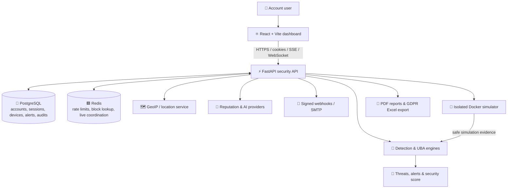
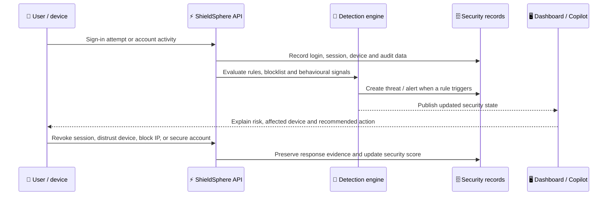

<div align="center">

# 🛡️ ShieldSphere

### Enterprise Account Security Platform


<p>
  
  
  
  
</p>

`🔐 Authentication` &nbsp;•&nbsp; `🧠 AI intelligence` &nbsp;•&nbsp; `📡 Real-time response` &nbsp;•&nbsp; `🧪 Safe attack rehearsal`

</div>

---

## Table of contents

- [The problem](#the-problem)
- [Solution overview](#solution-overview)
- [Why ShieldSphere is different](#why-shieldsphere-is-different)
- [Platform features](#platform-features)
- [System architecture](#system-architecture)
- [Security workflow](#security-workflow)
- [Technology stack](#technology-stack)
- [Project structure](#project-structure)
- [Quick start](#quick-start)
- [Environment configuration](#environment-configuration)
- [Testing and quality checks](#testing-and-quality-checks)
- [Deployment](#deployment)
- [Deploy the backend on Render](#deploy-the-backend-on-render)
- [Security notes](#security-notes)

---

## The problem

Modern account security is often fragmented. Authentication, devices, login history, breach status, suspicious activity, integrations, and compliance evidence live in separate places. This makes it difficult for a user or security team to answer critical questions quickly:

- **Who is signed in to this account right now?**
- **Is this device, location, or login pattern unusual?**
- **Was a threat detected, blocked, and recorded correctly?**
- **What should the user do next?**
- **Can the detection workflow be tested safely without attacking a real system?**

ShieldSphere brings those answers into one account-security control center.

## Solution overview

ShieldSphere is a full-stack platform that protects an account from sign-in through incident response. It combines strong authentication, device and session visibility, threat detection, behavioural analytics, AI assistance, compliance reporting, and isolated attack simulation.

| Security stage | ShieldSphere capability | User outcome |
|---|---|---|
| 🧱 Prevent | Password intelligence, passkeys, 2FA, trusted devices, IP blocklist | Reduces account-takeover risk before it starts |
| 👀 Observe | Login history, active sessions, recognized-device locations, audit trail | Makes account activity understandable and traceable |
| 🧠 Detect | Brute-force, SQLi, XSS, phishing, port scan, vulnerability and behavioural signals | Converts suspicious activity into threats and alerts |
| 🚨 Respond | Guided “Secure my account” containment, session revocation, device distrust, IP blocking | Provides immediate, focused recovery actions |
| 🧪 Validate | Docker-isolated sandbox simulations and attack-to-defense replay | Demonstrates that defensive controls work safely |
| 📋 Prove | Executive PDF reports and GDPR Excel export | Produces understandable evidence for users and compliance workflows |

## Why ShieldSphere is different

> **It does not only report security status — it connects prevention, detection, response, and safe validation in one user-facing product.**

| Unique feature | What makes it valuable |
|---|---|
| 🧪 **Attack-to-defense replay** | Runs controlled scenarios in an isolated Docker sandbox, then shows the progression from attack activity to detection, alerting, blocking, and outcome. |
| 🧭 **Contextual AI Copilot** | Answers questions using the user’s real security context, such as threats, alerts, login activity, devices, score factors, settings, and navigation guidance. |
| 🗺️ **Location-aware account visibility** | Displays approximate session and recognized-device locations with details on hover, without exposing unnecessary location data. |
| 🧬 **Two-device behavioural baseline** | Learns normal patterns only after two successful sign-ins from two recognized devices, reducing false confidence from a single-device baseline. |
| 🛟 **Guided account containment** | Consolidates urgent actions—revoke sessions, distrust devices, block suspicious IPs, and protect sign-in—into one response path. |
| 📄 **Human-readable compliance output** | Creates structured PDF security reports and Excel GDPR exports instead of raw JSON dumps. |

## Platform features

### 🔐 Identity and access protection

- Secure HTTP-only cookie authentication with access-token refresh.
- Password-strength checks and Have I Been Pwned breach-status support.
- TOTP two-factor authentication and WebAuthn passkeys.
- Recognized devices with browser, operating system, trust state, last IP, first/last seen, and approximate location.
- Active-session visibility with revoke-one and revoke-all controls.
- Manual and automatic IP blocklisting with a reason and timed duration.

### 📡 Detection, alerts, and response

- Threat and alert centre with severity, source IP, simulation context, remediation, and resolution state.
- Detection coverage for sandboxed brute force, SQL injection, cross-site scripting, port scanning, vulnerability scanning, packet capture, phishing, and social-engineering exercises.
- Behavioural anomaly scoring based on known devices, countries, network providers, typical hours, and sign-in frequency.
- Account device-activity timeline: sign-ins, failed sign-ins, active sessions, sign-outs/revocations, device details, IPs, and approximate locations.
- A score breakdown that explains the factors behind the account-security score.

### 🧠 Intelligence and assessment

- AI Copilot with security posture context and in-product navigation assistance.
- Website vulnerability scan with readable HTTPS and browser-header findings, risk explanation, and hardening guidance.
- URL and IP reputation assessment through supported external intelligence providers.
- AI-generated root-cause analysis and remediation guidance when configured.

### 🧪 Safe security validation

- Docker-isolated sandbox network with internet egress disabled by default.
- Copy-ready JSON parameter examples in [`attack_simulation_params.json`](attack_simulation_params.json).
- Live simulator event feed over WebSockets.
- Clear completed simulation runs without removing generated threat/alert evidence.
- Defensive replay timeline that measures detection, alerts, blocks, and time to detect.

### 📋 Compliance and integrations

- Detailed executive security report PDF with visual security posture, trends, recommendations, footer, and page numbers.
- Multi-sheet GDPR data export in Excel format.
- Auditable account actions with individual and clear-all log controls.
- Signed HMAC-SHA256 webhooks and optional SMTP email delivery.
- Integration health status and test delivery controls.

## System architecture

<div align="center">
  
</div>



### Core components

| Component | Responsibility |
|---|---|
| **React + Vite frontend** | Responsive dashboard, security controls, maps, simulator replay, report downloads, and user guidance. |
| **FastAPI backend** | Authenticated REST API, SSE Copilot stream, WebSocket simulator feed, security workflows, and policy enforcement. |
| **PostgreSQL** | Persistent users, login history, sessions, devices, threats, alerts, simulations, integrations, reports, and audit records. |
| **Redis** | Fast rate limiting, blocklist synchronization, and short-lived security coordination. |
| **Detection services** | Behavioural analytics, threat recording, security-score calculation, automated blocking, and response orchestration. |
| **Docker simulator** | Disposable, isolated attack environment for controlled exercises—not public-target attacks. |
| **External integrations** | AI, reputation intelligence, GeoIP, HMAC-signed webhooks, and optional email delivery. |

## Security workflow



## Technology stack

| Layer | Technologies |
|---|---|
| **Frontend** | React, TypeScript, Vite, TanStack Router, TanStack Query, Tailwind CSS, shadcn/ui, Leaflet |
| **Backend** | Python 3.12+, FastAPI, Pydantic, SQLAlchemy async, Alembic, Uvicorn |
| **Data and cache** | PostgreSQL, Redis, Psycopg |
| **Security** | HTTP-only cookies, JWT, TOTP, WebAuthn, HMAC-SHA256 webhook signing, CSP/HSTS, trusted-host validation, rate limiting |
| **Intelligence** | Groq-compatible AI, VirusTotal, AbuseIPDB, MaxMind GeoLite2 City |
| **Realtime** | Server-Sent Events and WebSockets |
| **Simulation** | Docker Desktop / Docker Engine, Nmap for port-scan exercises |
| **Reports** | ReportLab PDF generation and multi-sheet Excel export |
| **Deployment** | Vercel for the frontend; Docker, Caddy, Nginx, PostgreSQL, and Redis for the full production stack |

## Project structure

```text
ShieldSphere-Enterprise_Account_Security_Platform/
├── frontend/                 # React dashboard and UI components
│   └── src/routes/           # Dashboard, UBA, simulator, compliance, settings...
├── backend/                  # FastAPI application
│   ├── app/api/v1/           # Authenticated API modules
│   ├── app/services/         # Detection, UBA, AI, GeoIP, sandbox logic
│   ├── app/workers/          # Scheduled recovery and security jobs
│   └── alembic/              # Database migrations
├── docs/assets/              # README architecture artwork
├── attack_simulation_params.json
├── VERCEL_DEPLOYMENT.md      # Frontend deployment guide
├── compose.production.yml    # Full production stack
└── compose.simulator.yml     # Isolated simulator stack
```

## Quick start

### Prerequisites

| Requirement | Why it is needed |
|---|---|
| Python 3.12+ | FastAPI backend runtime |
| Node.js 18+ | React frontend development and build |
| PostgreSQL | Persistent application data |
| Redis | Rate limiting and security coordination |
| Docker Desktop | Attack-simulator sandbox |
| Nmap | Port-scan simulation support |
| GeoLite2 City `.mmdb` | Approximate IP geolocation |

### 1. Configure the environment

Copy the supplied templates and set real values locally. Never commit `.env` files.

```powershell
Copy-Item backend\.env.example backend\.env
Copy-Item frontend\.env.example frontend\.env
```

### 2. Start PostgreSQL and Redis

```powershell
# Verify PostgreSQL
Get-Service *postgres*

# Verify Redis (expected result: PONG)
redis-cli ping
```

### 3. Prepare and start the backend

```powershell
cd backend
venv\Scripts\alembic.exe upgrade head
.\scripts\start.ps1
```

Backend health: <http://127.0.0.1:8000/health>  
API documentation: <http://127.0.0.1:8000/docs>

> On Windows, use `scripts\start.ps1` rather than running Uvicorn directly. The script starts `main.py`, which applies the PostgreSQL-compatible event-loop policy.

### 4. Start the frontend

In a second terminal:

```powershell
cd frontend
npm install
npm run dev
```

Open <http://127.0.0.1:3000>.

## Environment configuration

### Backend (`backend/.env`)

```dotenv
DATABASE_URL=postgresql+psycopg://shieldsphere_admin:<password>@127.0.0.1:5432/shieldsphere
REDIS_URL=redis://localhost:6379/0
JWT_SECRET=<long-random-secret>
JWT_REFRESH_SECRET=<different-long-random-secret>
WEBAUTHN_RP_ID=127.0.0.1
WEBAUTHN_RP_NAME=ShieldSphere
WEBAUTHN_ORIGIN=http://127.0.0.1:3000
GROQ_API_KEY=<optional-ai-key>
VIRUSTOTAL_API_KEY=<optional-reputation-key>
ABUSEIPDB_API_KEY=<optional-reputation-key>
GEOLITE2_DB_PATH=./data/GeoLite2-City.mmdb
SANDBOX_NETWORK_INTERNET_EGRESS=false
APP_ENV=development
CORS_ORIGINS=http://localhost:3000,http://127.0.0.1:3000

# Optional email delivery
SMTP_HOST=
SMTP_PORT=587
SMTP_USERNAME=
SMTP_PASSWORD=
SMTP_FROM_EMAIL=
SMTP_USE_TLS=true
```

### Using Neon PostgreSQL

Neon is fully compatible with ShieldSphere. In the Neon console, use **Connect** to copy the connection string for the database branch you want to use, then set it as `DATABASE_URL` in `backend/.env`. Keep `sslmode=require` in the copied URL. The application automatically converts Neon's standard `postgresql://` format to SQLAlchemy's asynchronous `postgresql+psycopg://` driver format.

```dotenv
DATABASE_URL=postgresql://<user>:<password>@<endpoint>.neon.tech/<database>?sslmode=require
```

Run the normal backend startup command once after changing the URL. It applies every Alembic migration before the API starts, creating the ShieldSphere tables in the selected Neon database:

```powershell
cd backend
.\scripts\start.ps1
```

For long-running API deployments, prefer the direct Neon endpoint for migrations and this backend's `NullPool` connection model. Never commit the actual Neon connection URL; it includes the database password.

### Frontend (`frontend/.env`)

```dotenv
VITE_API_ORIGIN=http://127.0.0.1:8000
VITE_API_BASE_URL=http://127.0.0.1:8000/api/v1
VITE_SIMULATOR_WS_URL=ws://127.0.0.1:8000/api/v1/simulator/ws
```

### Passkey hostname note

WebAuthn passkeys are bound to a relying-party hostname. Local defaults use `127.0.0.1`. If you use `localhost` or deploy to a domain, set `WEBAUTHN_RP_ID` to that hostname and `WEBAUTHN_ORIGIN` to the exact HTTPS frontend origin.

## Testing and quality checks

Run these before committing or deploying:

```powershell
# Backend
cd backend
.\venv\Scripts\python.exe -m pytest -q
.\scripts\verify.ps1 -Integration

# Frontend
cd ..\frontend
npm run lint
npx tsc --noEmit
npm run build
```

For dependency auditing:

```powershell
backend\venv\Scripts\python.exe -m pip_audit -r backend\requirements.txt
npm --prefix frontend audit
```

## Deployment

### Vercel frontend

Deploy the Vite frontend to Vercel and configure `VITE_API_ORIGIN`, `VITE_API_BASE_URL`, and `VITE_SIMULATOR_WS_URL` to point to your deployed backend. Follow the full guide in [VERCEL_DEPLOYMENT.md](VERCEL_DEPLOYMENT.md).

### Deploy the backend on Render

> **Recommended runtime: Docker.** The backend is still a Python/FastAPI application, but its existing Dockerfile installs required operating-system packages such as Nmap and libpcap. Docker also keeps the deployed environment reproducible.

1. Push this repository to GitHub, then sign in to [Render](https://render.com).
2. Create a **PostgreSQL** database and a **Key Value** instance in the same Render region as the API. Keep their internal connection URLs private.
3. Select **New → Web Service**, connect this GitHub repository, and use these settings:

| Render setting | Value |
|---|---|
| Name | `shieldsphere-api` (or your preferred unique name) |
| Region | The same region as PostgreSQL and Key Value |
| Branch | Your production branch, such as `main` |
| Language | **Docker** |
| Root Directory | `backend` |
| Dockerfile Path | `./Dockerfile` |
| Docker Command | Leave blank; the repository entrypoint runs migrations and starts FastAPI |
| Health Check Path | `/health` |
| Auto-Deploy | Enable on push if desired |

Render assigns a `PORT` environment variable to web services. The backend container now reads that value automatically and falls back to port `8000` only outside Render.

4. Add these environment variables in Render’s **Environment** section. Use **Generate Value** for the two JWT secrets and never place actual secrets in Git:

| Variable | Render production value |
|---|---|
| `APP_ENV` | `production` |
| `DATABASE_URL` | Your Render PostgreSQL **internal** URL, changing the prefix from `postgresql://` to `postgresql+psycopg://` |
| `REDIS_URL` | Your Render Key Value internal Redis URL |
| `JWT_SECRET` | A distinct random secret of at least 32 characters |
| `JWT_REFRESH_SECRET` | A different random secret of at least 32 characters |
| `COOKIE_SECURE` | `true` |
| `CORS_ORIGINS` | Your exact Vercel URL, for example `https://your-app.vercel.app` |
| `ALLOWED_HOSTS` | `shieldsphere-api.onrender.com` and any configured API custom domain, comma-separated |
| `WEBAUTHN_RP_ID` | The hostname of the frontend where passkeys are used, for example `your-app.vercel.app` |
| `WEBAUTHN_ORIGIN` | The exact frontend origin, for example `https://your-app.vercel.app` |
| `TRUSTED_PROXY_NETWORKS` | Configure the trusted reverse-proxy network required by your deployment policy |
| `SANDBOX_NETWORK_INTERNET_EGRESS` | `false` |
| `API_DOCS_ENABLED` | `false` |
| `GROQ_API_KEY`, `VIRUSTOTAL_API_KEY`, `ABUSEIPDB_API_KEY` | Optional provider keys, if those features are enabled |
| `SMTP_*` | Optional; set all SMTP fields together only when email delivery is enabled |

5. Deploy, wait for the health check to pass, then copy the HTTPS API URL, such as `https://shieldsphere-api.onrender.com`.
6. In Vercel, update and redeploy the frontend with:

```dotenv
VITE_API_ORIGIN=https://shieldsphere-api.onrender.com
VITE_API_BASE_URL=https://shieldsphere-api.onrender.com/api/v1
VITE_SIMULATOR_WS_URL=wss://shieldsphere-api.onrender.com/api/v1/simulator/ws
```

7. Update `CORS_ORIGINS`, `ALLOWED_HOSTS`, and WebAuthn variables if you later attach custom domains. Sign in again after the deployment and verify `/health` plus a normal API action.

**Render limitation for the simulator:** the Render API service is appropriate for the dashboard, authentication, reports, AI, and normal detection workflows. The Docker attack simulator needs a controlled Docker daemon capable of creating isolated containers. Run that component on a separate dedicated simulator host or worker; do not try to expose a host Docker socket through the public Render API service.

If you intentionally deploy only the API features that do not require sandbox runs, Python 3 is possible with a build command such as `pip install -r requirements.txt` and a FastAPI start command. Docker is the correct choice for this repository because it supplies the required OS packages and matches the included production container.

### Full backend and simulator

The FastAPI API, PostgreSQL, Redis, scheduler, and Docker simulator need a Docker-capable server; they cannot run as ordinary Vercel frontend functions. The included production configuration uses Caddy for HTTPS, Nginx for the SPA, and a non-root FastAPI service.

```powershell
# Create a production-only secret file; do not commit it.
Copy-Item backend\.env.example backend\.env.production

# Validate the production prerequisites.
.\scripts\deploy-production.ps1 -ValidateOnly

# Build and start the production stack.
.\scripts\deploy-production.ps1
```

For the Docker simulator, use a dedicated simulator host or the explicit `-EnableSimulator` deployment option. Keep `SANDBOX_NETWORK_INTERNET_EGRESS=false`.

## Security notes

- Keep `.env`, `.env.production`, database backups, private keys, and GeoLite2 license files out of Git.
- Use long, independent secrets for JWT, PostgreSQL, Redis, SMTP, and webhook signing.
- Use HTTPS in production. Webhooks are HMAC-SHA256 signed and public endpoints are SSRF-validated.
- Docker socket access is highly privileged. Do not expose it to a public-facing application host without strong isolation.
- Run a single embedded scheduler instance unless you add a distributed lock or separate worker architecture.
- Treat simulator findings as exercises. They are deliberately separated from real account-security scoring.

---

<div align="center">

Built for clear, actionable account security.  
**ShieldSphere — protect, understand, and validate your defenses.**

</div>
